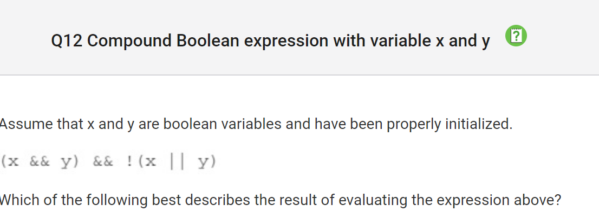
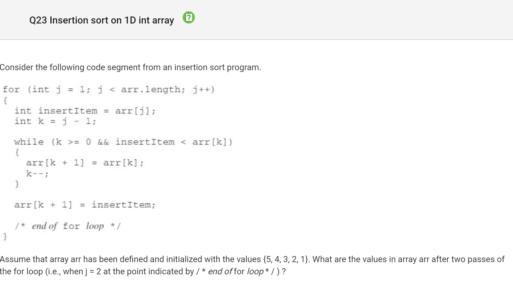
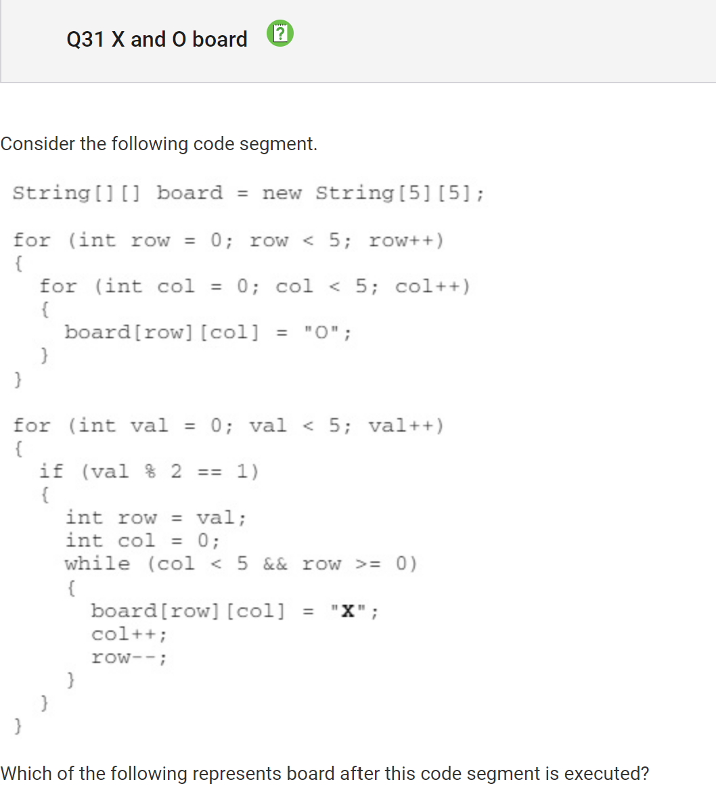
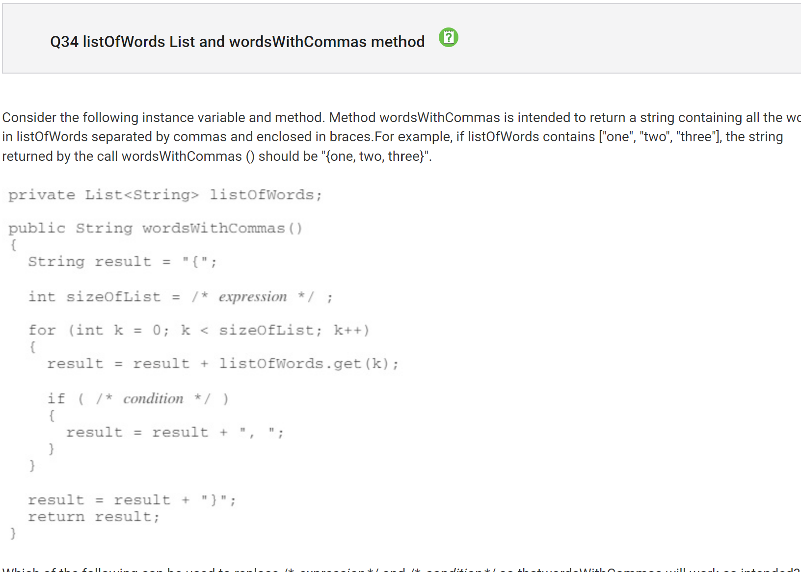
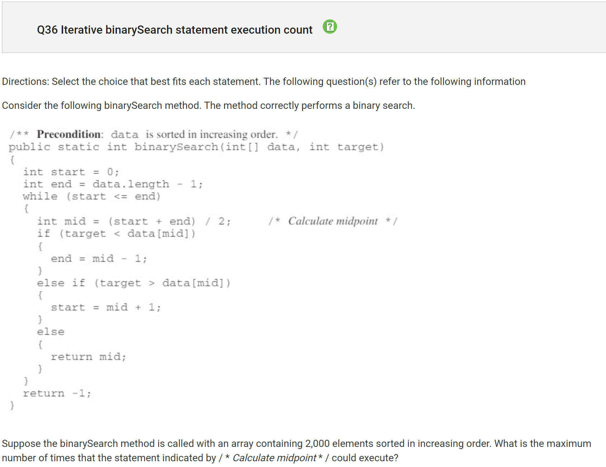
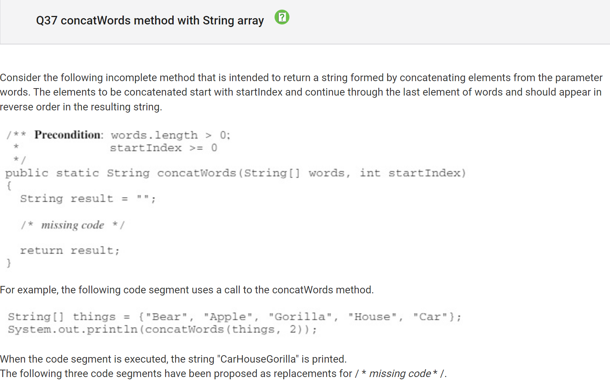
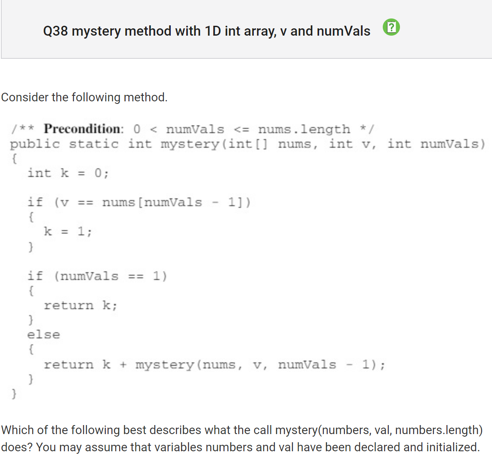

<h1>2015 AP CSA Multiple Choice Exam</h1>
<h1>Total Score: 32/39</h1>

<h2>Q12</h2>

My Answer: A (Always True)
Correct Answer: B (Always False)

Why?

The second half of the demorgan is a no x or not y, so it will always return false

<h2>Q23</h2>

My Answer: B ({3, 2, 1, 4, 5})
Correct Answer: C({3, 4, 5, 2, 1})

Why?

This insertion sort sorts the three largest values but doesn’t sort the two smallest because it doesn’t iterate fully through the array

<h2>Q31</h2>

My Answer: B 
Correct Answer: E 

Why?

The first loop shows that a “O” is placed everyone in all columns and rows. The second loop shows that an “X” while the val is divisible by 2 with a remainder of 1 integer. Since 0,2,and 4 aren’t divisible by 2 with a remainder of 1, it is impossible for and “X” to be placed on in those columns or rows with the value.

<h2>Q34</h2>

My Answer: C (/ * expression * / / / * condition * /
listOfWords.size() - 1 / k != sizeOfList - 1)

Correct Answer: D (/ * expression * / / / * condition * /
listOfWords.size() / k != sizeOfList - 1)

Why?

I did not find much of a difference between these answers so I guessed, but the real difference is that "listOfWords.size()" is /k and not -1.

<h2>Q36</h2>

My Answer: B (1000)
Correct Answer: D (11)

Why?

with a for each loop, the code iterates through each student.
With the getAge method, the age is added to the sum and the count has been increased.
Sum and count then are used for the average
Wrong answers include getting age and major without a getter or using arraylists when not needed

<h2>Q37</h2>

My Answer: C (III only)
Correct Answer: E (II and III)

Why?

II works because it starts from the end and the counter goes back. With it, the words can be printed in reverse order upto the index in the parameter.
III works because it moves items in the front to the back.

<h2>Q38</h2>

My Answer: B (Returns the index of the last element in numbers that is equal to val)
Correct Answer: C (Returns the number of elements in numbers that are equal to val)

Why?

Returns the number of elements in numbers that are equal to val
If statement adds one if the previous number is the same
Recursive.
