<h1>2015 AP CSA Multiple Choice Exam</h1>
<h1>Total Score: 32/39</h1>


<h2>Topics to grow in/review</h2>
<table>
    <tr>
        <th>Unit 1.B</th>
        <th>Unit 2</th>
        <th>Unit 4</th>
        <th>Unit 5</th>
    </tr>
    <tr>
        <td><a href="https://www.youtube.com/watch?v=-NXby4ahlnU&list=PLoGgviqq4845xKOY11PnkE7aqJC7-bYrd&index=1">CollegeBoard Video review</a></td>
        <td><a href="https://www.youtube.com/watch?v=wOzceGBpZRM&list=PLoGgviqq4845xKOY11PnkE7aqJC7-bYrd&index=2">CollegeBoard Video review</a></td>
        <td><a href="https://www.youtube.com/watch?v=D0k6tHQttzA&list=PLoGgviqq4845xKOY11PnkE7aqJC7-bYrd&index=4">CollegeBoard Video review</a></td>
        <td><a href="https://www.youtube.com/watch?v=2x_oA9ySlZc&list=PLoGgviqq4845xKOY11PnkE7aqJC7-bYrd&index=5">CollegeBoard Video review</a></td>
    </tr>
</table>


<h2>Q2</h2>


My Answer: C (When num is a positive even integer, "A" is printed; otherwise, "B" is printed.)
Correct Answer: D (When num is a positive even integer, "A" is printed; when num is a positive odd integer, "B" is printed; otherwise, nothing is printed.)

Why is my answer wrong?

* "B" is only printed in the case of a positive odd integer. Nothing is printed if num is not positive.

Why is this answer right?

* When num is positive and even, "A" is printed. When num is positive and not even (odd), "B" is printed. When num is not positive, nothing is printed.

<h2>Q3</h2>
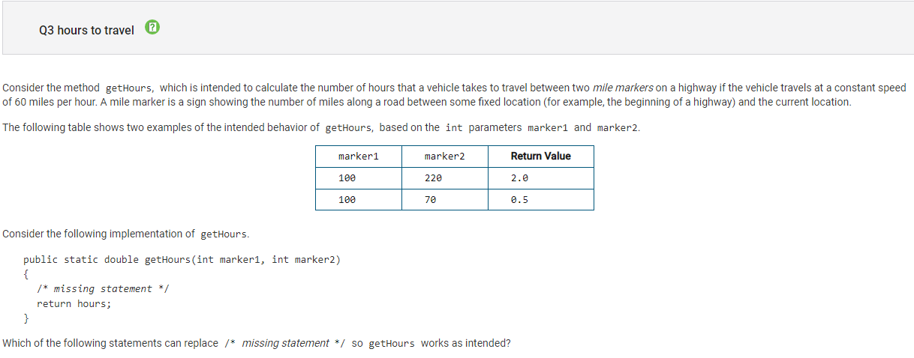

My Answer: D (
```java
double hours = Math.abs((marker1 - marker2) / 60);
```
)
Correct Answer: C (double hours = Math.abs(marker1 - marker2) / 60.0;)

Why is my answer wrong?

* Since marker1 and marker2 are both of type int, the expression (marker1 - marker2) / 60 performs integer division. For example, when marker1 has the value 100 and marker2 has the value 70, the expression evaluates to 0 instead of the intended 0.5.

Why is this answer right?

* The code segment takes the absolute value of the difference between marker1 and marker2, always producing a positive distance, and then divides the result by the vehicle’s speed.

<h2>Q5</h2>
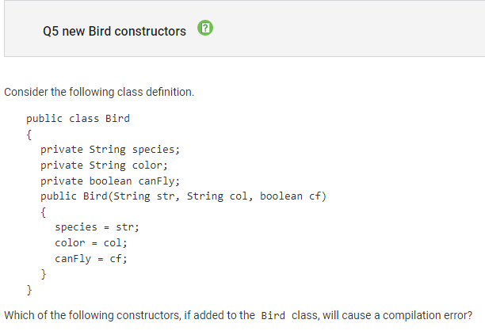

My Answer: A (
```java
public Bird()
{
species = "unknown";
color = "unknown";
canFly = false;
}
```
)
Correct Answer: E (
```java
public Bird(String col, String str, boolean cf)
{
species = str;
color = col;
canFly = cf;
}
```
)

Why is my answer wrong?

* This constructor’s signature differs from the signature of the existing constructor, so the new constructor can safely be added to the class definition.

Why is this answer right?

* This constructor has the same signature as the existing constructor (String, String, boolean). A compiler error will occur.

<h2>Q6</h2>


My Answer: E (I, II, and III)
Correct Answer: A (I only)

Why is my answer wrong?

* In option II, the cast applies to the result of the integer division 2 / 4, so the expression evaluates to 0.0 + 3, or 3.0. In option III, the cast applies to the sum of 3 and the result of the integer division 2 / 4, so the expression evaluates to (double) (0 + 3), or 3.0.

Why is this answer right?

* In option I, the cast applies to the value 2, so floating-point division is performed and the expression evaluates to 0.5 + 3, or 3.5. In option II, the cast applies to the result of the integer division 2 / 4, so the expression evaluates to 0.0 + 3, or 3.0. In option III, the cast applies to the sum of 3 and the result of the integer division 2 / 4, so the expression evaluates to (double) (0 + 3), or 3.0.

<h2>Q7</h2>
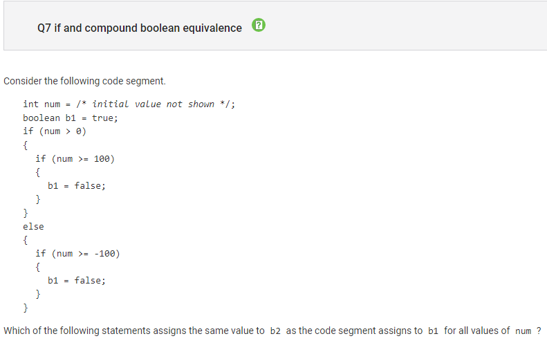

My Answer: C (
```java
boolean b2 = (num < -100) || (num > 100);
```
)
Correct Answer: E (
```java
boolean b2 = (num < -100) || (num > 0 && num < 100);
```
)

Why is my answer wrong?

* The statement assigns a different value to b2 than the code segment assigns to b1 when num is between 0 and 100, exclusive, or when num is greater than 100.

Why is this answer right?

* In the body of the first if clause in the code segment, b1 retains the value true if num is between 0 and 100, exclusive. In the body of the else clause, b1 retains the value true if num is less than -100. The statement assigns true to b2 if num is less than -100 or between 0 and 100, exclusive.

<h2>Q8</h2>
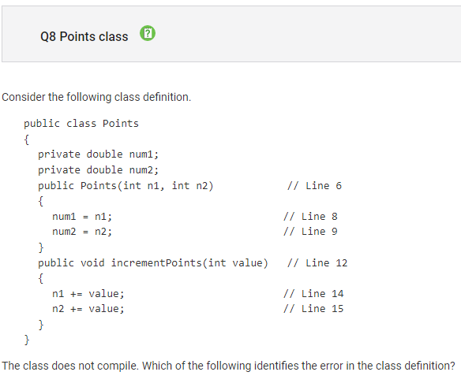

My Answer: B (In lines 8 and 9, int values cannot be assigned to double variables.)
Correct Answer: D (In lines 14 and 15, the variables n1 and n2 are not defined.)

Why is my answer wrong?

* Assigning int values to double variables is allowed, although assigning double values to int variables is not allowed.

Why is this answer right?

* The variables n1 and n2 are not instance variables of the Points class, nor are they defined in the incrementPoints method. The instance variables num1 and num2 should have been used instead of n1 and n2.

<h2>Q10</h2>
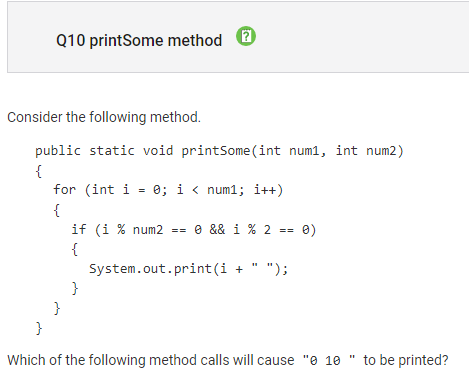

My Answer: A (printSome(0, 20))
Correct Answer: D (printSome(20, 5))

Why is my answer wrong?

* The loop body is never executed as a result of this method call and nothing is printed.

Why is this answer right?

* The for loop iterates from i = 0 to i = 19. The expression i % num2 == 0 evaluates to true when i is divisible by 5 and the expression i % 2 == 0 evaluates to true when i is even. The only values in the range 0 to 19, inclusive, that are both divisible by 5 and even are 0 and 10, so the statement prints "0 10 ".

<h2>Q13</h2>


My Answer: C (!a && !b || c)
Correct Answer: E (!a || !b || c)

Why is my answer wrong?

* The expressions are not equivalent when a has the value true, b has the value false, and c has the value false.

Why is this answer right?

* By De Morgan’s laws, !(a && b) is equivalent to !a || !b and the entire expression is equivalent to !a || !b || c.

<h2>Q14</h2>
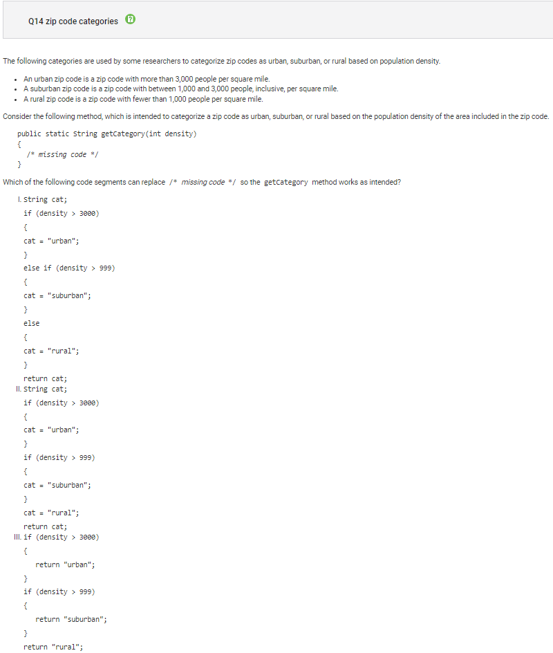

My Answer: A (I only)
Correct Answer: D (I and III only)

Why is my answer wrong?

* Code segment III returns the correct category through the use of an immediate return within each of the one-way selection statements.

Why is this answer right?

* Code segment I uses multi-way selection to assign and return the correct category. Code segment II returns "rural" for all values of density because it uses a series of one-way selection statements instead of multi-way selection. Code segment III returns the correct category through the use of an immediate return within each of the one-way selection statements.

<h2>Q16</h2>
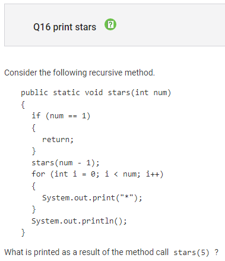

My Answer: A (*****)
Correct Answer: B (
```java
**

***

****

*****
``` 
)

Why is my answer wrong?

* This output would be printed if the recursive call stars(num - 1) were missing.

Why is this answer right?

* The recursive call of the stars method occurs before any output is printed, so the method call stars(5) results in a recursive call to stars(4), then to stars(3), then to stars(2), and finally to stars(1). The call to stars(1) returns immediately without printing any output, so the first call that produces output is stars(2), which prints a row of two stars. Then, stars(3) prints a row of three stars, stars(4) prints a row of four stars, and finally stars(5) prints a row of five stars.

<h2>Q18</h2>


My Answer: B (int p = 0; p < data.length; p++)
Correct Answer: E (int p = 1; p < data.length - 1; p++)

Why is my answer wrong?

* The reference data[p - 1] in the Boolean condition in the if statement causes an ArrayIndexOutOfBoundsException to be thrown when p has the value 0.

Why is this answer right?

* By definition, the first candidate for a local maximum is the element at index 1 (the second element in the array), and the last candidate is the element at index data.length - 2 (the next to last element in the array).

<h2>Q19</h2>


My Answer: C (21)
Correct Answer: D (26)

Why is my answer wrong?

* This would be the result of adding the original elements of the values array, without doubling the first element of every row.

Why is this answer right?

* The nested for loops traverse the two-dimensional array values. The first element of each row is doubled and then the sum of all elements is computed as 2+2+3+8+5+6=26.

<h2>Q20</h2>


My Answer: E (
```java
if (bookArr[b].getPages() > maxPages)
{
maxPages = bookArr[b].getPages();
}
```
)
Correct Answer: B (
```java
if (b.getPages() > maxPages)
{
maxPages = b.getPages();
}
```
)

Why is my answer wrong?

* In the enhanced for loop, b is a Book object and cannot be used as an index.

Why is this answer right?

* The enhanced for loop traverses bookArr and the loop control variable b is assigned Book objects. The instance variable pages is declared private in the Book class, so it must be accessed from outside the Book class using the accessor method getPages. The if statement compares the value returned by the call b.getPages() to the current value of maxPages. If the returned value is greater than maxPages, maxPages is updated with the new maximum value.

<h2>Q21</h2>
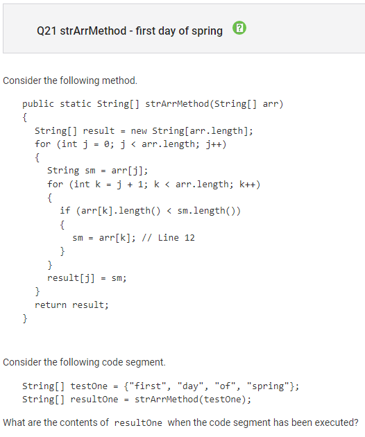

My Answer: B ({"of", "day", "first", "spring"})
Correct Answer: D ({"of", "of", "of", "spring"})

Why is my answer wrong?

* This would represent the contents of resultOne if the method assigned values to elements of resultOne in increasing order of string length.

Why is this answer right?

* The method assigns the shortest string that occurs in any element of arr between arr[n] and arr[arr.length - 1], inclusive, to result[n]. The shortest string found between arr[0] and arr[3] is "of", so result[0] is assigned the value "of". The shortest string found between arr[1] and arr[3] is also "of", so result[1] is also assigned the value "of". The same is true for the part of the array that begins at index 2 and ends at index 3, so result[2] is also assigned the value "of". In the last iteration of the outer for loop, there are no values to consider after arr[3], so result[3] is assigned the value "spring".

<h2>Q22</h2>
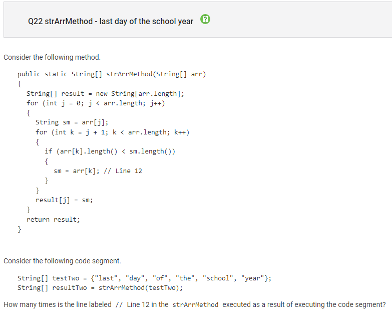

My Answer: D (15 times)
Correct Answer: A (4 times)

Why is my answer wrong?

* This would be the result if the method had no if statement and sm was updated once for each pair arr[j] and arr[k] encountered in the nested for loops.

Why is this answer right?

* Line 12 is executed each time the variable sm is updated because a new smallest value is found. When j has the value 0, sm is updated for "day" and "of". When j has the value 1, sm is updated for "of". When j has the value 4, sm is updated for "year". When j has any of the values 2, 3, or 5, sm is not updated. Line 12 is executed four times.

<h2>Q23</h2>
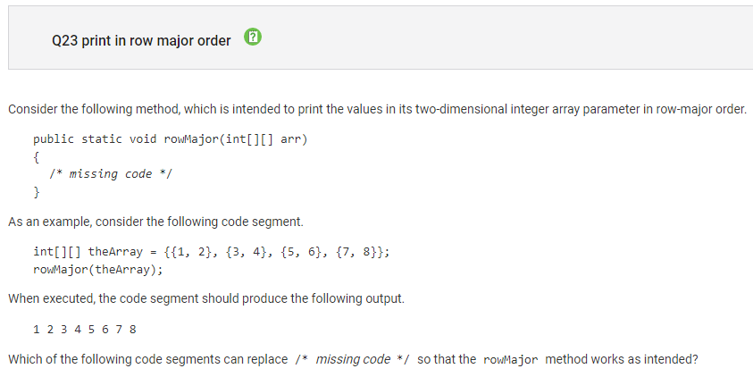

My Answer: B (
```java
for (int j : arr)
{
   for (int k : j)
   {
      System.out.print(k + " ");
   }
}
```
)
Correct Answer: D (
```java
for (int[] j : arr)
{
   for (int k : j)
   {
      System.out.print(k + " ");
   }
}
```
)

Why is my answer wrong?

* The outer for loop in this code segment declares j, a row of arr, as an int rather than an int[].

Why is this answer right?

* The outer for loop stores each row of the two-dimensional array in j, a one-dimensional array. The inner for loop stores each element of j in k and prints k.

<h2>Q26</h2>
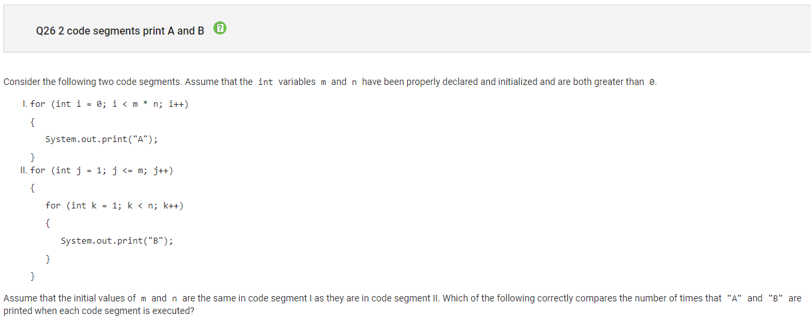

My Answer: A ("A" is printed m fewer times than "B".)
Correct Answer: D ("A" is printed n more times than "B".)

Why is my answer wrong?

* This would be the correct comparison if the initialization and Boolean condition in the inner for loop of code segment II were k = 0 and k <= n, respectively.

Why is this answer right?

* There are m * n iterations of the for loop in code segment I. In code segment II, the outer loop executes m times and the inner loop executes n - 1 times for each iteration of the outer loop. There are m * n - m iterations of the inner loop in code segment II, so "A" is printed m more times than "B" is printed.

<h2>Q27</h2>


My Answer: B (Never)
Correct Answer: E (When b has the value false)

Why is my answer wrong?

* The variable c will be assigned the value false when b has the value false, regardless of the value of a.

Why is this answer right?

* When b has the value false, both of the expressions (a && b) and (!a && b) evaluate to false, regardless of the value of a. The entire expression evaluates to false || false, or false. When b has the value true, one of the expressions (a && b) or (!a && b) evaluates to true. The entire expression, in this case, is either true || false or false || true, or true. A truth table can be used to summarize these results.

<h2>Q28</h2>


My Answer: E (Nothing is returned because a StringIndexOutOfBoundsException is thrown.)
Correct Answer: B ("si the so")

Why is my answer wrong?

* The method does not attempt to access a substring that begins at an index less than 0 or ends at an index greater than length - 1.

Why is this answer right?

* The method abMethod(String a, String b) removes all non-overlapping occurrences of string b from string a and returns the resulting String. It does this by repeatedly setting x to the index of an occurrence of b in a, then assigning a the result of the concatenation of the parts of a before and after the occurrence of b. The method call abMethod("sing the song", "ng") removes all occurrences of "ng" from "sing the song", returning "si the so".

<h2>Q31</h2>
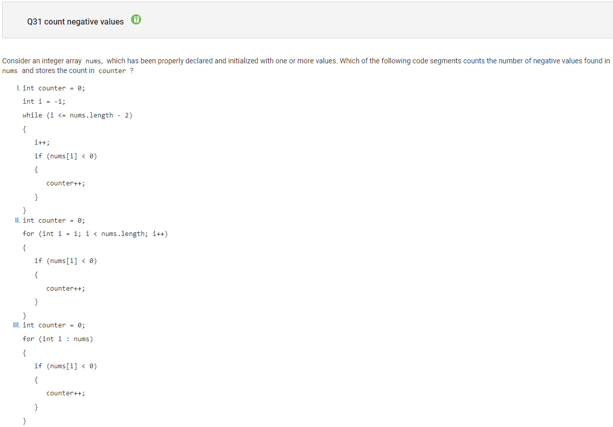

My Answer: D (I and III only)
Correct Answer: A (I only)

Why is my answer wrong?

* In code segment III, the variable i represents an element of the array rather than an index.

Why is this answer right?

* In code segment I, i takes on the values -1 through nums.length - 2, inclusive, in the while loop. Since i is incremented before the if statement, the array elements nums[0] through nums[nums.length - 1] are compared to 0. In code segment II, array element nums[0] is excluded since the first iteration of the for loop accesses nums[1]. In code segment III, the variable i represents an element of the array rather than an index.

<h2>Q33</h2>
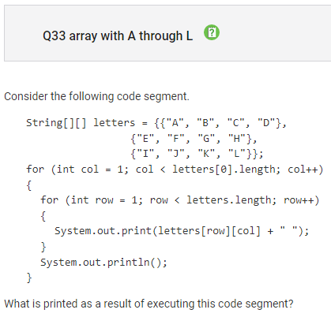

My Answer: A (
A E I
F J
K
)
Correct Answer: E (
F J
G K
H L
)

Why is my answer wrong?

* This output would be generated if col and row were initialized to 0 and col, respectively, in the for loops.

Why is this answer right?

* The code segment performs a column-major traversal of the array, beginning with the second column and the second row. For each column, all values in that column after the value in the first row are printed on a single line. The println method call causes data from subsequent columns to appear on new lines in the output.

<h2>Q34</h2>
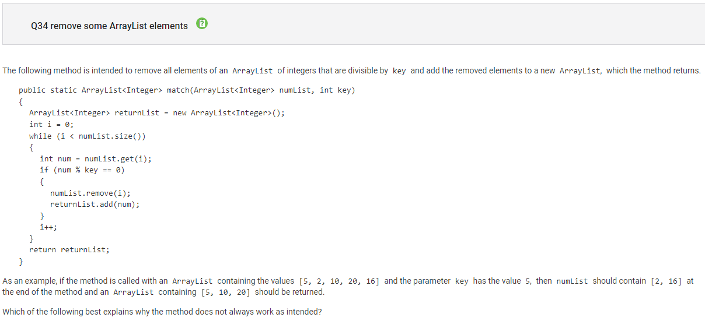

My Answer: C (The method causes an IndexOutOfBoundsException to be thrown.)
Correct Answer: B (The method skips some elements of numList during the traversal.)

Why is my answer wrong?

* The get and remove methods are always called with a valid index, since the body of the while loop is executed for values of i between 0 and the current value of numList.size() - 1.

Why is this answer right?

* When the element at position i is removed from numList, subsequent elements are shifted left. After the removal, the element that used to be at position i + 1 is now at position i. Because the method increments i regardless of whether the element at position i was removed, the method does not always work as intended. For example, if two adjacent elements are both divisible by key, only the first element is removed. The method could be corrected by incrementing i only when the element at position i is not removed or by decrementing i when an element is removed.

<h2>Q35</h2>
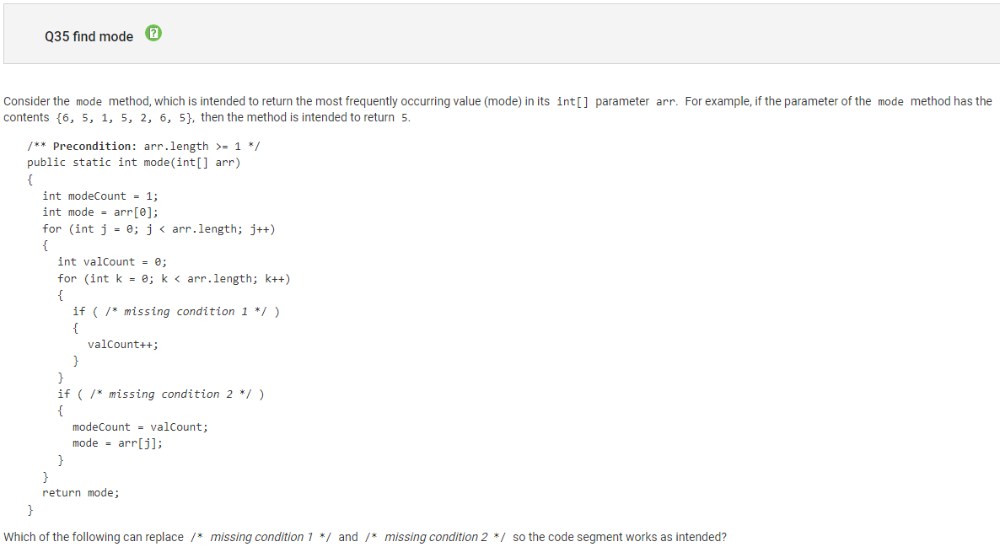

My Answer: D (
<table>
    <tr>
        <td>/* missing condition 1 */</td>
        <td>/* missing condition 2 */</td>
    </tr>
    <tr>
        <td>arr[j] != arr[k]</td>
        <td>modeCount > valCount</td>
    </tr>
</table>
)
Correct Answer: A (
<table>
    <tr>
        <td>/* missing condition 1 */</td>
        <td>/* missing condition 2 */</td>
    </tr>
    <tr>
        <td>arr[j] == arr[k]</td>
        <td>valCount > modeCount</td>
    </tr>
</table>
)

Why is my answer wrong?

* The replacements for /* missing condition 1 */ and /* missing condition 2 */ are incorrect. Because of the incorrect replacement for /* missing condition 1 */, the method would count the number of times that values different than arr[j] appear in arr instead of the number of times that arr[j] appears in arr. Because of the incorrect replacement for /* missing condition 2 */, the method would update the mode value to be returned only if it was less common than values considered previously.

Why is this answer right?

* For each element arr[j], the inner for loop counts the number of times that arr[j] appears in arr and stores the result in valCount. It does this by evaluating the condition arr[j] == arr[k] and incrementing valCount when the condition evaluates to true. After the inner loop completes, the method evaluates the condition valCount > modeCount. If the condition evaluates to true, a new mode has been found and mode and modeCount are updated.

<h2>Q36</h2>
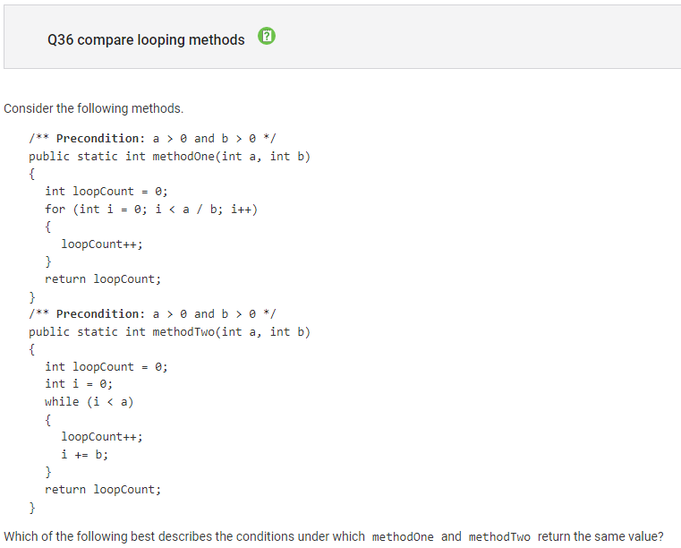

My Answer: B (When a and b are both odd)
Correct Answer: D (When a % b is equal to zero)

Why is my answer wrong?

* When a has the value 21 and b has the value 5, methodOne returns 4 and methodTwo returns 5. In general, if a % b is not equal to 0, methodOne returns a / b and methodTwo returns a / b + 1.

Why is this answer right?

* The body of the for loop in methodOne is executed a / b times. The body of the while loop in methodTwo is executed a / b times only when a % b is equal to 0. When a % b is not equal to 0, the body of the while loop in methodTwo is executed an additional time. For example, when a has the value 11 and b has the value 5, a / b evaluates to 2 and the for loop is executed two times but the while loop is executed three times.

<h2>Q38</h2>


My Answer: E (I and III)
Correct Answer: D (I and II)

Why is my answer wrong?

* Option II is correct. The code segment uses an enhanced for loop to traverse the valueList array. The statement inside the loop calls the getNum method to access the num instance variable. Option III is incorrect. The code segment causes a compilation error because the getNum method must be called using the dot operator, not by passing the object reference as an argument.

Why is this answer right?

* Option I is correct. The code segment uses a for loop to traverse the valueList array. The statement inside the loop calls the get method to access a Value object and then calls the getNum method to access the num instance variable. Option II is correct. The code segment uses an enhanced for loop to traverse the valueList array. The statement inside the loop calls the getNum method to access the num instance variable. Option III is incorrect. The code segment causes a compilation error because the getNum method must be called using the dot operator, not by passing the object reference as an argument.

<h2>Q39</h2>


My Answer: A (recurMethod("abcba"))
Correct Answer: D (recurMethod("edcba"))

Why is my answer wrong?

* This method call returns false because the first character is lexicographically less than the second character of the string.

Why is this answer right?

* If the first character of str is lexicographically greater than the second character of str, the method returns the result of the recursive call with a parameter that contains all but the first character of str. If the first character of str is lexicographically less than or equal to the second character of str, the method returns false. If no such character pair (where the first character of str is lexicographically less than or equal to the second character of str) is found, the base case is reached and the value true is returned.

<h2>Q40</h2>
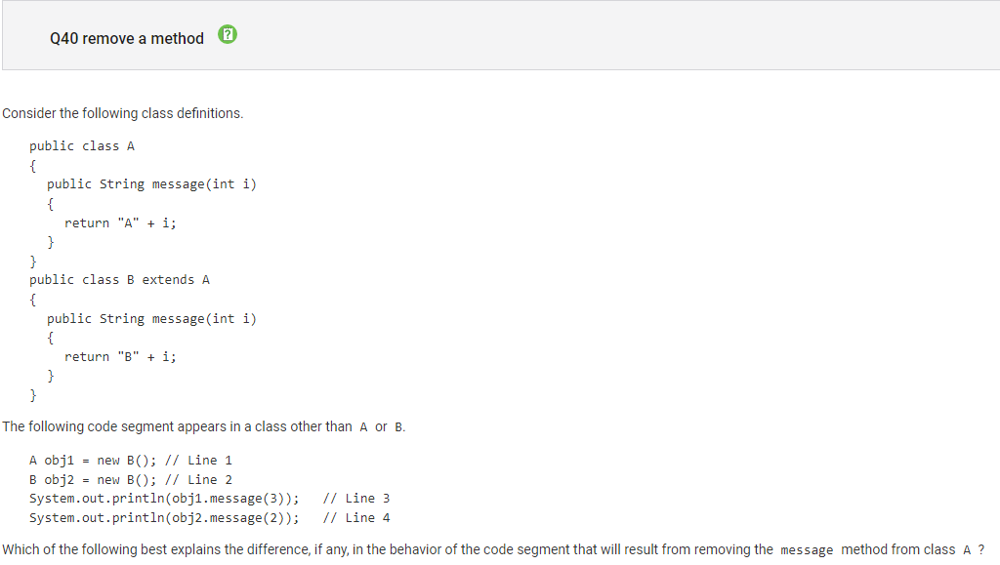

My Answer: B (The statement in line 4 will cause a compiler error because the message method for obj2 cannot be found.)
Correct Answer: A (The statement in line 3 will cause a compiler error because the message method for obj1 cannot be found.)

Why is my answer wrong?

* At compile time, methods in or inherited by the declared type determine the correctness of a non-static method call. In line 2, obj2 is declared as an object of type B. Therefore, at compile time, there must be a message method in class B or its superclass. Since the message method in class B has not been removed, this statement will not cause a compiler error.

Why is this answer right?

* At compile time, methods in or inherited by the declared type determine the correctness of a non-static method call. In line 1, obj1 is declared as an object of type A. Therefore, at compile time, there must be a message method in class A or its superclass. If the message method in class A is removed, the statement in line 3 will no longer compile.

